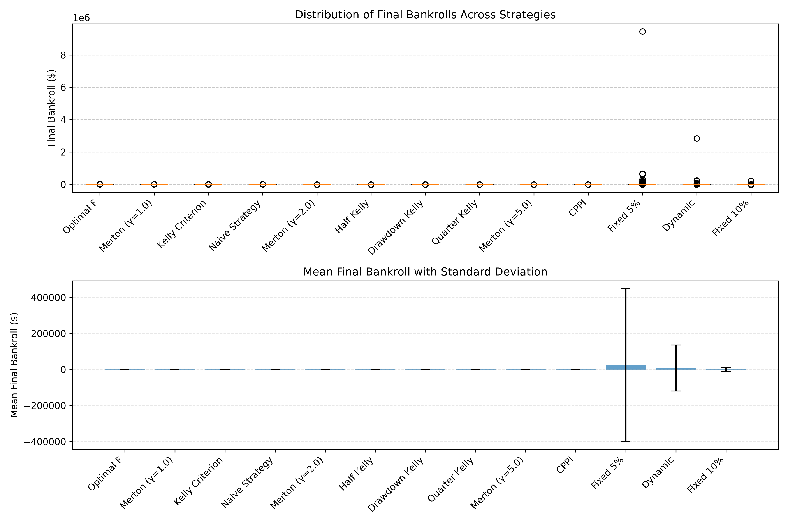

# Keeks

[](LICENSE.md)

**Python bet sizing and bankroll simulation for developers modeling repeated
binary outcomes.**

Given your estimated win probability, payoff, loss, and normalized transaction
cost, Keeks calculates a model-derived fraction of the current bankroll to stake.
You can then run the same rule over repeated trials and inspect the bankroll path.

**[Nine-strategy risk benchmark](https://wdm0006.github.io/keeks/strategy_benchmark.html)** — what growth, drawdown and
early-stop behaviour each shipped strategy actually produces under identical, seeded assumptions,
and how that changes with edge, cost, probability-estimate error and the bankroll's loss cap.
Regenerate every number with `uv run python benchmarks/strategy_benchmark.py`.

## Install

```bash
pip install keeks
```

Keeks supports Python 3.10 through 3.14.

## Get a bet fraction

```python
from keeks.binary_strategies import KellyCriterion

bankroll = 1_000.0
strategy = KellyCriterion(
    payoff=1.0,
    loss=1.0,
    transaction_cost=0.01,
)

fraction = strategy.evaluate(probability=0.55, current_bankroll=bankroll)
amount = bankroll * fraction

print(f"Bankroll fraction: {fraction:.4%}")
print(f"Amount from a $1,000 bankroll: ${amount:.2f}")
```

```text
Bankroll fraction: 9.0009%
Amount from a $1,000 bankroll: $90.01
```

`evaluate()` returns a fraction, not a currency amount. The example multiplies
that fraction by the current bankroll only to make the result concrete.

## Compare repeated-bet strategies

Keeks includes a headless comparison example that gives every strategy a fresh
bankroll under the same repeated-bet inputs:

```bash
python -m examples.strategy_comparison
```



The chart is one simulated comparison under the example's assumptions. It does
not validate the probability estimate or predict future results.

## Choose a strategy

All nine strategies expose `evaluate(probability, current_bankroll)`, but their
constructors and sizing rules differ.

| Strategy | Choose it when you want to model |
|---|---|
| `KellyCriterion` | Full Kelly sizing from a binary win probability, payoff, loss, and cost. |
| `FractionalKellyCriterion` | A fixed fraction of the full-Kelly result. |
| `DrawdownAdjustedKelly` | Kelly sizing scaled by an acceptable-drawdown input. |
| `OptimalF` | A geometric-growth rule based on a supplied win rate, with a risk-fraction cap. |
| `FixedFractionStrategy` | A constant fraction above a minimum probability; useful as a baseline. |
| `CPPIStrategy` | A cushion-based rule relative to a bankroll floor. |
| `DynamicBankrollManagement` | A fraction adjusted from recent recorded outcomes. |
| `MertonShare` | A CRRA risk-aversion rule adapted to binary outcomes. |
| `NaiveStrategy` | A positive-expected-value rule without utility-based sizing. |

See the [strategy API](https://wdm0006.github.io/keeks/binary_strategies.html)
for constructor parameters and formulas.

## Simulate a bankroll

Once you have chosen a strategy, pass it and a fresh `BankRoll` to a simulator:

```python
from keeks.bankroll import BankRoll
from keeks.binary_strategies import FractionalKellyCriterion
from keeks.simulators.repeated_binary import RepeatedBinarySimulator

bankroll = BankRoll(
    initial_funds=1_000.0,
    percent_bettable=0.8,
    max_draw_down=0.3,
)
strategy = FractionalKellyCriterion(
    payoff=1.0,
    loss=1.0,
    transaction_cost=0.01,
    fraction=0.5,
)
simulator = RepeatedBinarySimulator(
    payoff=1.0,
    loss=1.0,
    transaction_costs=0.01,
    probability=0.55,
    trials=1_000,
)

simulator.evaluate_strategy(strategy, bankroll)

print(f"Final bankroll: ${bankroll.total_funds:.2f}")
bankroll.plot_history(fname="bankroll-history.png")
```

Simulation mutates the bankroll and records its history. Use matching payoff,
loss, and cost assumptions in the strategy and simulator; Keeks does not enforce
that they match.

## Repeated sizing is not one-time pricing

`strategy.evaluate(...)` answers a repeated-bet question:

> Given this binary model, what fraction of the current bankroll does this rule
> allocate now?

`find_indifference_price(...)` and supported
`strategy.calculate_max_entry_price(...)` methods answer a different question:

> Given possible outcomes and their probabilities, what is the maximum entry
> price that leaves modeled utility unchanged for a one-time gamble?

Run the shipped decision-theory example with:

```bash
python -m examples.st_petersburg_paradox
```

See [`examples/st_petersburg_paradox.py`](examples/st_petersburg_paradox.py) and
the [utilities documentation](https://wdm0006.github.io/keeks/utils.html) for
the one-time workflow.

## Safety semantics and model limits

- Strategy fractions are floored at zero and capped so the modeled loss plus
  transaction cost cannot allocate more than the current bankroll.
- `BankRoll` can restrict the bettable percentage and stop a simulation when a
  withdrawal breaches its configured maximum drawdown.
- These constraints apply to the values in Keeks' binary model. They do not
  prevent losses, verify your probability estimate, or model spreads, slippage,
  market impact, venue-specific commissions, correlated positions, or portfolio
  rebalancing.
- `transaction_cost` is a normalized per-bet model input. Keep it consistent
  between a strategy and its simulator.

## Documentation and examples

- [Full documentation](https://wdm0006.github.io/keeks/)
- [Getting started](https://wdm0006.github.io/keeks/getting_started.html)
- [Strategy API](https://wdm0006.github.io/keeks/binary_strategies.html)
- [Bankroll API](https://wdm0006.github.io/keeks/bankroll.html)
- [Simulators](https://wdm0006.github.io/keeks/simulators.html)
- [Nine-strategy risk benchmark](https://wdm0006.github.io/keeks/strategy_benchmark.html)
- [`examples/strategy_comparison.py`](examples/strategy_comparison.py)
- [`examples/st_petersburg_paradox.py`](examples/st_petersburg_paradox.py)

## Disclaimer

Keeks is for educational purposes. It does not provide investment, legal, or tax
advice. Models and simulations can be wrong, and financial loss is possible. You
are responsible for validating your inputs and deciding whether any real-world use
is appropriate.

## Contributing

Contributions are welcome. To set up the project and run its checks:

```bash
git clone https://github.com/wdm0006/keeks.git
cd keeks
make setup
make install-dev
make test
make lint
```

Build the documentation with:

```bash
make docs
```

Keeks is available under the [MIT License](LICENSE.md).
