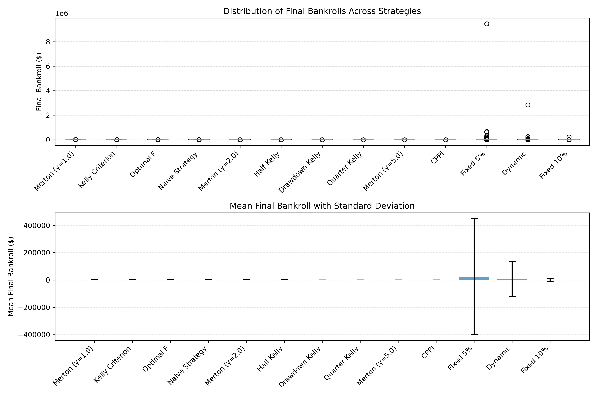

# Keeks

[](LICENSE.md)

**Python bet sizing and bankroll simulation for developers modeling repeated
binary outcomes.**

Given your estimated win probability, payoff, loss, and normalized transaction
cost, Keeks calculates a model-derived fraction of the current bankroll to stake.
You can then run the same rule over repeated trials and inspect the bankroll path.
For portfolios of distribution-valued options — correlated or not — the
[`keeks.allocation`](https://keeks.mcginniscommawill.com/allocation.html) layer
sizes long-only weight vectors through one configurable joint-return model.

**[Nine-strategy risk benchmark](https://keeks.mcginniscommawill.com/strategy_benchmark.html)** — what growth, drawdown and
early-stop behaviour each shipped strategy actually produces under identical, seeded assumptions,
and how that changes with edge, cost, probability-estimate error and the bankroll's loss cap.
Regenerate every number with `uv run python benchmarks/strategy_benchmark.py`.

## Install

```bash
pip install keeks
```

Keeks supports Python 3.10 through 3.14. The portfolio-allocation layer's
QP/LP solvers need one optional extra (everything else is numpy-only):

```bash
pip install "keeks[allocation]"
```

## Get a bet fraction

```python
from keeks.binary_strategies import KellyCriterion

bankroll = 1_000.0
strategy = KellyCriterion(
    payoff=1.0,
    loss=1.0,
    transaction_cost=0.01,
)

fraction = strategy.evaluate(probability=0.55, current_bankroll=bankroll)
amount = bankroll * fraction

print(f"Bankroll fraction: {fraction:.4%}")
print(f"Amount from a $1,000 bankroll: ${amount:.2f}")
```

```text
Bankroll fraction: 9.0009%
Amount from a $1,000 bankroll: $90.01
```

`evaluate()` returns a fraction, not a currency amount. The example multiplies
that fraction by the current bankroll only to make the result concrete.

## Compare repeated-bet strategies

Keeks includes a headless comparison example that gives every strategy a fresh
bankroll under the same repeated-bet inputs:

```bash
python -m examples.strategy_comparison
```



The chart is one simulated comparison under the example's assumptions. It does
not validate the probability estimate or predict future results.

## Choose a strategy

All nine strategies expose `evaluate(probability, current_bankroll)`, but their
constructors and sizing rules differ.

| Strategy | Choose it when you want to model |
|---|---|
| `KellyCriterion` | Full Kelly sizing from a binary win probability, payoff, loss, and cost. |
| `FractionalKellyCriterion` | A fixed fraction of the full-Kelly result. |
| `DrawdownAdjustedKelly` | Kelly sizing scaled by an acceptable-drawdown input. |
| `OptimalF` | A geometric-growth rule based on a supplied win rate, with a risk-fraction cap. |
| `FixedFractionStrategy` | A constant fraction above a minimum probability; useful as a baseline. |
| `CPPIStrategy` | A cushion-based rule relative to a bankroll floor. |
| `DynamicBankrollManagement` | A fraction adjusted from recent recorded outcomes. |
| `MertonShare` | A CRRA risk-aversion rule adapted to binary outcomes. |
| `NaiveStrategy` | A positive-expected-value rule without utility-based sizing. |

See the [strategy API](https://keeks.mcginniscommawill.com/binary_strategies.html)
for constructor parameters and formulas.

## Simulate a bankroll

Once you have chosen a strategy, pass it and a fresh `BankRoll` to a simulator:

```python
from keeks.bankroll import BankRoll
from keeks.binary_strategies import FractionalKellyCriterion
from keeks.simulators.repeated_binary import RepeatedBinarySimulator

bankroll = BankRoll(
    initial_funds=1_000.0,
    percent_bettable=0.8,
    max_draw_down=0.3,
)
strategy = FractionalKellyCriterion(
    payoff=1.0,
    loss=1.0,
    transaction_cost=0.01,
    fraction=0.5,
)
simulator = RepeatedBinarySimulator(
    payoff=1.0,
    loss=1.0,
    transaction_costs=0.01,
    probability=0.55,
    trials=1_000,
)

simulator.evaluate_strategy(strategy, bankroll)

print(f"Final bankroll: ${bankroll.total_funds:.2f}")
bankroll.plot_history(fname="bankroll-history.png")
```

The test suite executes this exact block as a seeded, down-scaled demo — the
simulator clamped to 50 trials with a fixed seed and the plot rendered
headlessly — so the example stays runnable; the narrative above describes the
full 1,000-trial run.

Simulation mutates the bankroll and records its history. Use matching payoff and
Simulation mutates the bankroll and records its history. Use matching payoff and
loss assumptions in the strategy and simulator: Keeks enforces the match. Every
simulator's `evaluate_strategy` checks that a `BaseStrategy` instance's `payoff`
and `loss` agree with the odds it settles at, and raises `ValueError` on a
mismatch. Duck-typed strategies that carry no odds of their own are not checked —
their compatibility stays your responsibility. The cost assumption is a separate
matter — see the note below.

## Repeated sizing is not one-time pricing

`strategy.evaluate(...)` answers a repeated-bet question:

> Given this binary model, what fraction of the current bankroll does this rule
> allocate now?

`find_indifference_price(...)` and supported
`strategy.calculate_max_entry_price(...)` methods answer a different question:

> Given possible outcomes and their probabilities, what is the maximum entry
> price that leaves modeled utility unchanged for a one-time gamble?

Run the shipped decision-theory example with:

```bash
python -m examples.st_petersburg_paradox
```

See [`examples/st_petersburg_paradox.py`](examples/st_petersburg_paradox.py) and
the [utilities documentation](https://keeks.mcginniscommawill.com/utils.html) for
the one-time workflow.

## Size portfolios across distribution-valued options

Binary strategies size one bet at a time; `keeks.allocation` sizes a
**portfolio** of N options described by return distributions — a mean vector
and covariance, a scenario matrix, keeks-native binary bets, fitted
parametric marginals, or any callable sampler. Every allocator returns one
long-only weight per option, each in `[0, 1]`, summing to at most one; the
residual is cash held at zero return, so your `BankRoll` is reused untouched.

**Inputs are a configurable joint-return model**, not a per-method schema.
Adapters build one from what you have; allocators consume it through one
sampling contract (`sample(n, rng)`):

- `binary_bets_model([(p, payoff, loss), ...])` — keeks' own binary bets,
  with per-bet BLAKE2b-keyed streams matching the portfolio simulator
- `scenario_model(rows)` — an empirical returns matrix (resample it with a
  Generator and it is an iid bootstrap)
- `fit_marginals_model(returns, family="student_t")` — parametric marginals
  fitted to a history (normal, Student-t, Laplace, lognormal, binary),
  independent by default, Gaussian-copula dependence with scipy
- `marginals_model([...])` — marginals specified directly, and plain
  callables for anything else

Models that know their closed-form moments expose them exactly via
`moments()`; the rest are estimated from draws. The Kelly identity is the
accent: mean-variance at risk aversion λ = 1 is the second-order Kelly
allocation.

```python
from keeks import MeanVariance, binary_bets_model

# Three simultaneous binary bets: (win probability, payoff, loss)
model = binary_bets_model([(0.55, 1.0, 1.0), (0.60, 0.8, 1.0), (0.52, 1.2, 1.0)])

# λ = 1 mean-variance is the second-order Kelly allocation
strategy = MeanVariance.from_model(model, n_samples=4096, seed=42)
print(strategy.evaluate(current_bankroll=1_000.0))  # weights, not amounts
```

**Method families:**

| Family | Methods | Needs |
|---|---|---|
| Moment-based | `MeanVariance`, `GlobalMinimumVariance`, `MaximumSharpe`, `MaximumDiversification`, `RiskBudgeting` (ERC) | μ, Σ (covariance-only for GMV/ERC/max-div) |
| Wrapper | `RiskAversionScaling(inner, factor)` — the fractional-Kelly dial | any allocator |
| Scenario-based | `MeanCVaR` — an LP over scenarios; defined even without finite variance | scenario rows |
| Structure-based | `HierarchicalRiskParity` — never inverts Σ, sizes ill-conditioned books | Σ |
| Estimators | `shrink_covariance` (Ledoit–Wolf), `black_litterman_mean` (views) | Σ̂ / μ |
| Online | `FixedWeights`, `ExponentialGradient`, `OnlineNewtonStep` — adapt from realized returns via `record_settlement` | the settlement hook |

Every allocator also exposes `optimize() -> AllocationResult` (weights plus
solver diagnostics: convergence, iterations, estimated log-growth,
volatility), and `from_model(model, ...)` builds one straight from any model.

**Simulate the portfolio** the same way you simulate single bets — batch-net
settlement through the bankroll machinery, refuse-then-stop ruin policy,
flat per-period costs, single-seed-stream reproducibility:

```python
from keeks import AllocationSimulator, BankRoll
from keeks import bankroll_paths, drawdown, weight_evolution

simulator = AllocationSimulator(scenarios, trials=1000, seed=42)
bankroll = BankRoll(initial_funds=1_000.0)
simulator.evaluate_strategy(strategy, bankroll)

bankroll_paths(
    {"strategy": bankroll.history}
)  # and drawdown(), weight_evolution(), ...
```

The visualization helpers (`bankroll_paths`, `drawdown`, `weight_evolution`,
`risk_contributions`, `efficient_frontier`, `correlation_heatmap`,
`dendrogram`, `scenario_losses`) are matplotlib-only and deterministic — they
return the axes they drew on. A worked example runs a six-ETF book (SPY,
QQQ, IWM, TLT, GLD, VNQ) through both input-model helpers and five
allocators, offline from a committed fixture:

```bash
uv run python examples/allocation_etfs.py            # offline, seeded
uv run python examples/allocation_etfs.py --refresh  # re-download via yfinance
```

## Safety semantics and model limits

- Strategy fractions are floored at zero and capped so the modeled loss plus
  transaction cost cannot allocate more than the current bankroll.
- `BankRoll` can restrict the bettable percentage and stop a simulation when a
  withdrawal breaches its configured maximum drawdown.
- These constraints apply to the values in Keeks' binary model. They do not
  prevent losses, verify your probability estimate, or model spreads, slippage,
  market impact, or venue-specific commissions. Correlated positions and
  portfolio rebalancing are modeled by the allocation layer (`keeks.allocation`),
  under its own long-only weight contract and simulator semantics.
- A strategy's `transaction_cost` is a per-unit *fractional* cost that scales
  with stake size. A simulator's `transaction_costs` (plural) is a flat,
  *absolute* bankroll amount charged once per settled bet. The two are
  different units — passing the same number to both models two different
  real-world costs, and Keeks does not convert between them.
- `KellyCriterion` sizes on edge by default (`min_probability=None`): any bet
  its formula prices positively is placed, and a bet with no positive edge
  returns 0.0. Set `min_probability` to add a longshot gate — a trial
  probability below it returns 0.0 even when the Kelly fraction is positive,
  with a `UserWarning` naming the suppressed fraction. The other strategies'
  probability gates are unchanged (`OptimalF` hardcodes a 0.5 gate).

## Documentation and examples

- [Full documentation](https://keeks.mcginniscommawill.com/)
- [Getting started](https://keeks.mcginniscommawill.com/getting_started.html)
- [Strategy API](https://keeks.mcginniscommawill.com/binary_strategies.html)
- [Bankroll API](https://keeks.mcginniscommawill.com/bankroll.html)
- [Simulators](https://keeks.mcginniscommawill.com/simulators.html)
- [Portfolio allocation](https://keeks.mcginniscommawill.com/allocation.html)
- [Allocation visualization helpers](https://keeks.mcginniscommawill.com/allocation_plots.html)
- [Nine-strategy risk benchmark](https://keeks.mcginniscommawill.com/strategy_benchmark.html)
- [`examples/strategy_comparison.py`](examples/strategy_comparison.py)
- [`examples/st_petersburg_paradox.py`](examples/st_petersburg_paradox.py)
- [`examples/allocation_etfs.py`](examples/allocation_etfs.py)

## References

- [1] [A New Interpretation of Information Rate](http://www.herrold.com/brokerage/kelly.pdf) - The original Kelly Criterion paper
- [2] [The Kelly Criterion in Blackjack, Sports Betting, and the Stock Market](https://www.amazon.com/Kelly-Criterion-Blackjack-Sports-Betting/dp/1096432366) - A practical guide to applying the Kelly Criterion
- [3] [Fortune's Formula](https://www.amazon.com/Fortunes-Formula-Scientific-Betting-Casinos/dp/0809045990) - The untold story of the scientific betting system that beat the casinos and Wall Street

## Disclaimer

Keeks is for educational purposes. It does not provide investment, legal, or tax
advice. Models and simulations can be wrong, and financial loss is possible. You
are responsible for validating your inputs and deciding whether any real-world use
is appropriate.

## Contributing

Contributions are welcome. To set up the project and run its checks:

```bash
git clone https://github.com/wdm0006/keeks.git
cd keeks
make setup
make install-dev
make test
make lint
```

Build the documentation with:

```bash
make docs
```

Keeks is available under the [MIT License](LICENSE.md).
