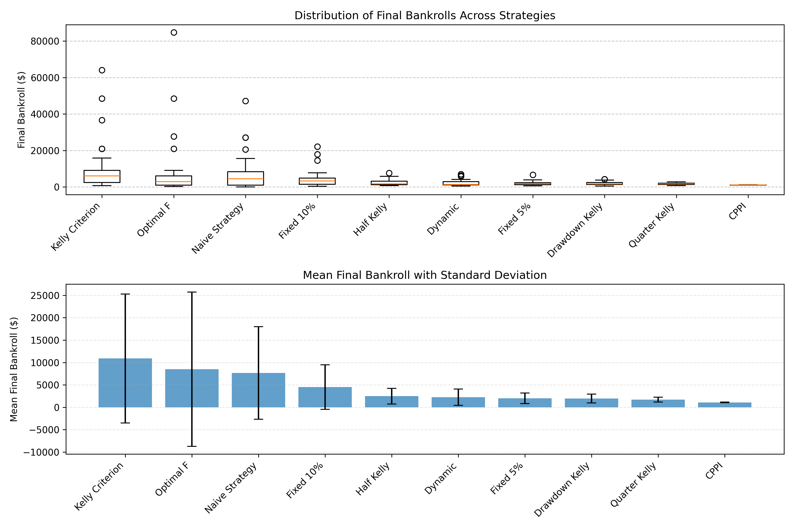

# Keeks

[](https://opensource.org/licenses/MIT)

A Python library for optimal bankroll allocation and betting strategies, with a focus on the Kelly Criterion and its variants.

Full documentation at [keeks.mcginniscommawill.com](https://keeks.mcginniscommawill.com).

## What is Keeks?

Keeks is a specialized Python library designed to help you implement and test various betting and investment strategies. It provides tools for:

- **Bankroll management**: Track and manage your funds with built-in protection against excessive losses
- **Betting strategies**: Implement mathematically optimal strategies like the Kelly Criterion
- **Simulation**: Test your strategies under different conditions before risking real money

Whether you're a sports bettor, a financial trader, or a researcher in decision theory, Keeks provides the tools to make more informed decisions about capital allocation.

## Why Use Keeks?

- **Mathematically sound**: Based on proven mathematical principles like the Kelly Criterion
- **Risk management**: Built-in protection against ruin with configurable drawdown limits
- **Simulation-driven**: Test strategies in various scenarios before applying them with real money
- **Flexible**: Supports different types of betting scenarios and probability distributions
- **Educational**: Learn about optimal betting strategies through practical implementation

**Disclaimer**: This library is for educational purposes only. It is not intended to provide investment, legal, or tax advice. Always be responsible and consult with a professional before applying these strategies to real-world betting or investment scenarios. The authors and contributors of this library are not liable for any financial losses or damages that may result from the use of this software.

## Installation

```bash
pip install keeks
```

## Quick Start

Here's a simple example of how to use Keeks to simulate a betting strategy:

```python
from keeks.bankroll import BankRoll
from keeks.binary_strategies.kelly import KellyCriterion
from keeks.simulators.repeated_binary import RepeatedBinarySimulator

# Create a bankroll with initial funds
bankroll = BankRoll(initial_funds=1000.0, max_draw_down=0.3)

# Create a Kelly Criterion strategy
# Parameters: payoff, loss, transaction_cost
strategy = KellyCriterion(payoff=1.0, loss=1.0, transaction_cost=0.01)

# Create a simulator with a fixed probability
simulator = RepeatedBinarySimulator(
    payoff=1.0, 
    loss=1.0, 
    transaction_costs=0.01, 
    probability=0.55,  # 55% chance of winning
    trials=1000
)

# Run the simulation
simulator.evaluate_strategy(strategy, bankroll)

# Plot the results
bankroll.plot_history()
```

## Examples

### St. Petersburg Paradox Simulation

The St. Petersburg paradox is a theoretical game with infinite expected value but finite practical outcomes. Our example compares all binary strategies using a simplified binary model with favorable odds.

```python
python -m examples.st_petersburg_comparison
```

The example simulates various strategies under favorable betting conditions and visualizes the results:



*This chart shows the distribution of final bankrolls across different betting strategies after multiple simulations. Notice how Optimal-F and Kelly Criterion achieved the highest returns but with greater volatility, while more conservative strategies like Quarter Kelly had more consistent (but lower) returns.*

For more examples, check the [examples directory](examples/).

## Key Features

### Bankroll Management

The `BankRoll` class provides a way to track your funds and enforce risk management:

```python
# Create a bankroll with $1000, allowing only 80% to be bet, and a 30% max drawdown limit
bankroll = BankRoll(initial_funds=1000.0, percent_bettable=0.8, max_draw_down=0.3)
```

### Betting Strategies

Keeks implements several betting strategies:

1. **Kelly Criterion**: The mathematically optimal strategy for maximizing the logarithm of wealth
   ```python
   kelly = KellyCriterion(payoff=1.0, loss=1.0, transaction_cost=0.01)
   ```

2. **Fractional Kelly**: A more conservative version of Kelly that reduces volatility
   ```python
   fractional_kelly = FractionalKellyCriterion(payoff=1.0, loss=1.0, transaction_cost=0.01, fraction=0.5)
   ```

3. **Drawdown-Adjusted Kelly**: A Kelly variant that adjusts bet sizing based on risk tolerance
   ```python
   drawdown_kelly = DrawdownAdjustedKelly(payoff=1.0, loss=1.0, transaction_cost=0.01, max_acceptable_drawdown=0.2)
   ```

4. **OptimalF (Ralph Vince)**: Strategy that maximizes geometric growth rate
   ```python
   from keeks.binary_strategies.simple import OptimalF
   optimal_f = OptimalF(payoff=1.0, loss=1.0, transaction_cost=0.01, win_rate=0.55, max_risk_fraction=0.2)
   ```

5. **Fixed Fraction**: Simple strategy that bets a constant percentage of the bankroll
   ```python
   fixed_fraction = FixedFractionStrategy(fraction=0.05, min_probability=0.5)
   ```

6. **CPPI (Constant Proportion Portfolio Insurance)**: Strategy that protects a floor value while allowing upside exposure
   ```python
   cppi = CPPIStrategy(floor_fraction=0.5, multiplier=2.0, initial_bankroll=1000.0)
   ```

7. **Dynamic Bankroll Management**: Adaptive strategy based on recent performance
   ```python
   dynamic = DynamicBankrollManagement(base_fraction=0.1, payoff=1.0, loss=1.0, window_size=10)
   ```

8. **Naive Strategy**: A simple strategy that bets the full amount when expected value is positive
   ```python
   naive = NaiveStrategy(payoff=1.0, loss=1.0, transaction_cost=0.01)
   ```

### Simulators

Test your strategies with different simulators:

1. **RepeatedBinarySimulator**: For scenarios with a fixed probability
2. **RandomBinarySimulator**: For scenarios with varying probabilities
3. **RandomUncertainBinarySimulator**: For scenarios where your probability estimate has uncertainty

## Applications

Keeks can be applied to various domains:

- **Sports Betting**: Optimize your bet sizing based on your edge
- **Financial Trading**: Apply Kelly principles to portfolio management
- **Gambling**: Understand the mathematics behind optimal betting
- **Research**: Study the behavior of different betting strategies
- **Education**: Learn about probability, statistics, and risk management

## Documentation

To build the docs locally:

```bash
git clone https://github.com/wdm0006/keeks.git
cd keeks
pip install -e ".[dev]"
make docs
```

## Development

To set up the development environment:

```bash
git clone https://github.com/wdm0006/keeks.git
cd keeks
make setup
make install-dev
```

Run tests:

```bash
make test
```

## References

- [1] [A New Interpretation of Information Rate](http://www.herrold.com/brokerage/kelly.pdf) - The original Kelly Criterion paper
- [2] [The Kelly Criterion in Blackjack, Sports Betting, and the Stock Market](https://www.amazon.com/Kelly-Criterion-Blackjack-Sports-Betting/dp/1096432366) - A practical guide to applying the Kelly Criterion
- [3] [Fortune's Formula](https://www.amazon.com/Fortunes-Formula-Scientific-Betting-Casinos/dp/0809045990) - The untold story of the scientific betting system that beat the casinos and Wall Street

## License

MIT License - see the [LICENSE](./LICENSE.md) file for details.

## Contributing

Contributions are welcome! Please feel free to submit a Pull Request.

---

