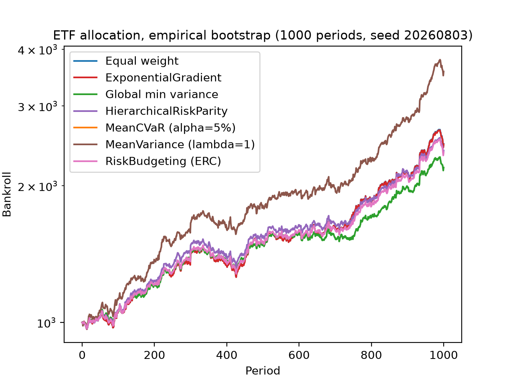
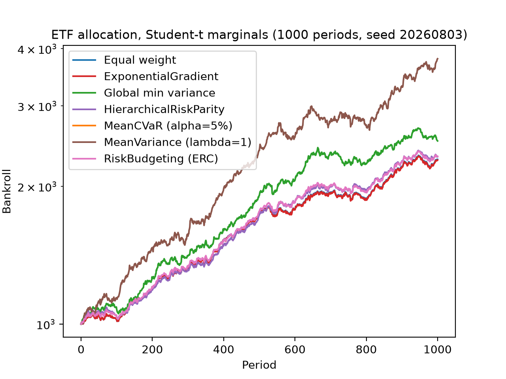
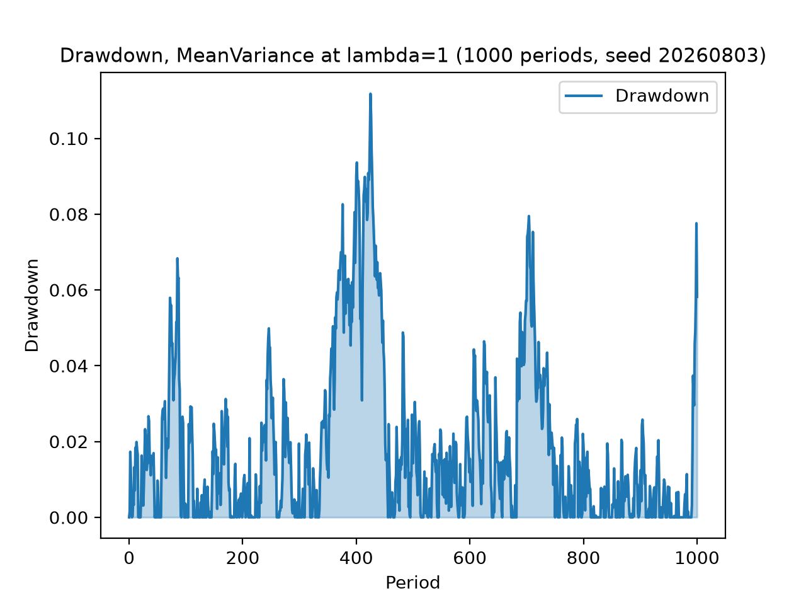
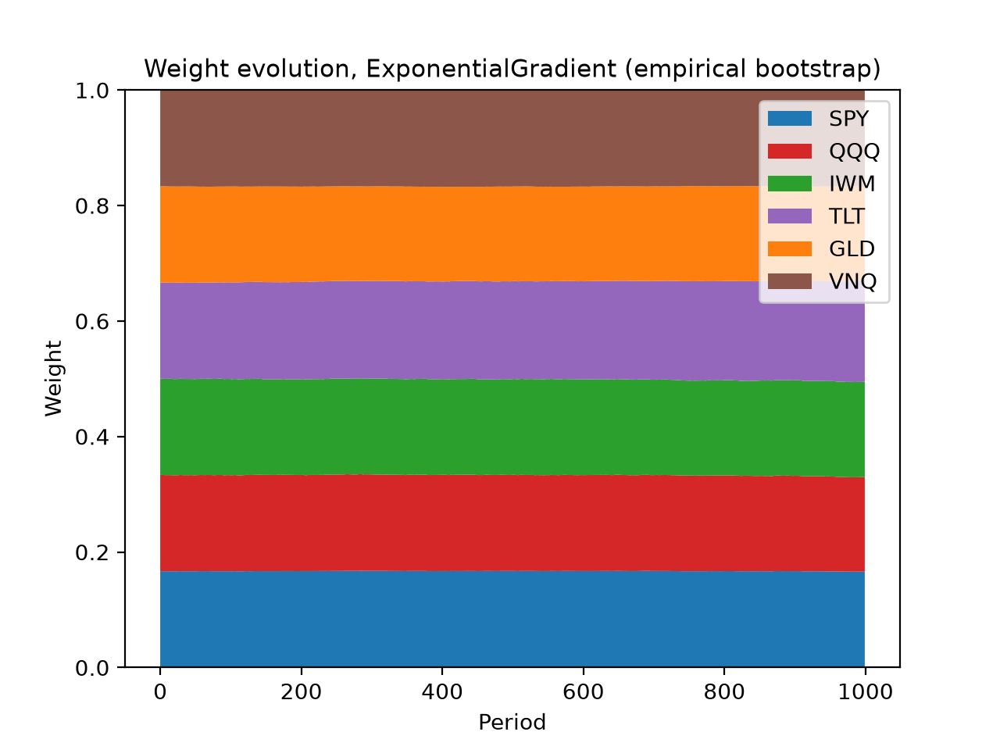

Allocation over ETF returns
===========================

``examples/allocation_etfs.py`` runs keeks' allocation layer over a real
six-ETF book — SPY, QQQ, IWM, TLT, GLD and VNQ, spanning US large-cap and
small-cap equities, growth, long treasuries, gold and real estate — and
asks the question the single-bet pages cannot: what do the allocators
actually disagree about, when they all size the same portfolio?

Two joint-return models are built from the same committed daily simple
returns (``examples/data/etf_returns.csv``, window 2022-10-03 to
2025-10-01): the empirical bootstrap via
:func:`keeks.allocation.models.scenario_model`, and per-option Student-t
marginals fitted by maximum likelihood via
:func:`keeks.allocation.models.fit_marginals_model` (a scipy-gated extra).
Each model is then replayed for 1,000 periods through the
:class:`keeks.allocation.simulators.AllocationSimulator` with seven books
side by side: five allocators — ``MeanVariance`` at λ = 1, ``RiskBudgeting``
(ERC), ``HierarchicalRiskParity``, ``MeanCVaR`` at α = 5% and the online
``ExponentialGradient`` — against two benchmarks, equal weight and global
minimum variance. Every allocator inside a pass meets the same seeded
realizations (common random numbers, seed 20260803), so the comparison is
the allocators' and not the draw luck's.

.. warning::

   These are simulated results from a model, not a forecast and not
   investment advice. The replay resamples one three-year window of history
   and charges no fees — neither of which holds in a real book. Keeks is an
   educational library; treat every number below as a property of the
   model, not a prediction about money.

Growth paths
------------

         periods for seven books over the empirical bootstrap model.
         MeanVariance at lambda=1 climbs furthest, ending near 3,800
         dollars. Global minimum variance ends near 2,300, and equal
         weight, ExponentialGradient and risk budgeting climb together to
         roughly 2,500. MeanCVaR stays flat at the 1,000 dollar starting
         line for the whole replay.
   :width: 100%

   Growth of the seven books under the empirical bootstrap model, seed
   20260803. MeanVariance at λ = 1 leads throughout; MeanCVaR's flat line
   is its unit-risk-aversion posture holding cash (below).

The same comparison under fitted fat-tailed marginals keeps the ordering:

         periods for the same seven books, replayed under per-option
         Student-t marginals. MeanVariance at lambda=1 again leads, ending
         near 3,800 dollars; global minimum variance ends near 2,550; the
         equal-weight, ExponentialGradient and risk-budgeting cluster
         finishes near 2,350; and MeanCVaR again holds the 1,000 dollar
         starting line.
   :width: 100%

   Growth of the same seven books under Student-t marginals fitted to the
   same window. The Student-t draws carry no scenario rows, so MeanCVaR —
   still bound to the empirical scenarios — reprices nothing here.

Drawdown and weights
--------------------

         lambda=1 replay over 1,000 periods. Drawdown repeatedly returns to
         zero, with spikes to about 0.07 near period 100, the maximum of
         about 0.11 around period 430, a secondary peak of about 0.08 near
         period 700, and a final spike to about 0.078 at the horizon.
   :width: 100%

   Peak-to-trough drawdown of the leading book, MeanVariance at λ = 1,
   over the empirical-bootstrap replay. The growth story above is bought
   with drawdowns of this size.

         weights over 1,000 periods, labelled SPY, QQQ, IWM, TLT, GLD and
         VNQ. The bands start near one sixth of the book each — roughly
         0.17 — and stay almost flat, with only a slight drift in the
         treasury and real-estate bands.
   :width: 100%

   Weight evolution of the online allocator, ExponentialGradient, recorded
   each period during the empirical-bootstrap pass and relabelled with the
   tickers. It starts near equal weight and barely moves.

MeanCVaR holds cash, on purpose
-------------------------------

The flat line at $1,000 in both growth charts is ``MeanCVaR`` at its
shipped unit risk aversion, and it is the example's most instructive result
rather than a failed solve. The objective trades expected return against
the tail's expected loss one-for-one, and it is positively homogeneous in
the return scale — so on daily-frequency market data, where expected daily
return sits far below the tail's expected loss, the honest optimum is full
cash. No unit choice changes that; the risk-aversion dial is a documented
follow-up. The mean-variance family, which squares the same trade-off
against variance rather than the tail, sizes aggressively on the same
inputs — which is exactly the contrast the side-by-side replay exists to
show.

Reproducing it
--------------

One command, from a checkout of the repository:

.. code-block:: bash

   uv run python examples/allocation_etfs.py

The default run is fully offline — it loads the committed fixture, whose
provenance header names the tickers, the date window and the refresh
command — and prints a comparison table (final funds, growth, per-period
volatility, maximum drawdown) for each pass before writing the four charts
above into ``examples/output/``. Pass ``--refresh`` to re-download the
window from Yahoo Finance via yfinance (a development-only dependency;
keeks never imports it at runtime) and rewrite the fixture first.
