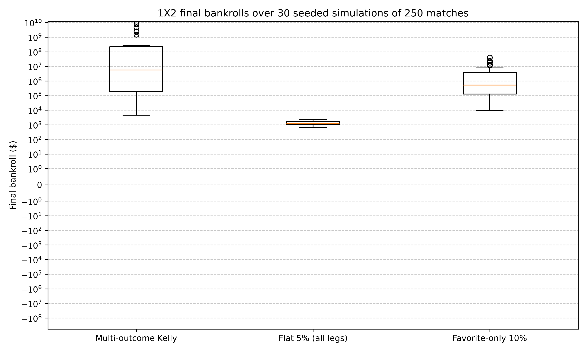

1X2 betting with multi-outcome Kelly
====================================

``examples/multi_outcome_1x2.py`` bets the three legs of one mutually
exclusive football market — a 1X2 book — with the same fixed prices every
match: a home win at probability 0.42 and decimal odds 3.2 (edge +0.344),
a draw at probability 0.27 and odds 3.4 (edge −0.082), and an away win at
probability 0.28 and odds 2.4 (edge −0.328). The quoted probabilities sum
to 0.97, so the remaining 3% of the mass is a void round: no leg settles
and every stake is refunded.

Three strategies are compared over 30 seeded simulations of 250 matches
each, from a $1,000 bankroll:

- **Multi-outcome Kelly** — the log-growth-optimal stake per leg. It backs
  the home leg most, hedges a little on the draw's rich odds, and declines
  the negative-edge away leg entirely.
- **Flat 5% (all legs)** — stakes 5% of the bankroll on every leg. Two of
  the three legs are negative-edge, so most of this stake works against
  the bettor; the home edge still carries the portfolio.
- **Favorite-only 10%** — stakes 10% on the most probable leg only.
  Positive expectation, but a cruder allocation than Kelly's.

The script also demonstrates the reproducibility contract as public
behaviour: the same seeded simulator run twice replays the identical
bankroll history, and the script asserts it.

.. warning::

   These are simulated results from a model, not a forecast and not
   betting advice. The market is a made-up book with fixed prices and
   probabilities you cannot get from a real bookmaker, and the void-round
   convention is the simulator's, not a settlement rule any exchange
   offers. Keeks is an educational library; treat every number below as a
   property of the model, not a prediction about money.

What the spread says
--------------------

         three strategies over 30 seeded simulations of 250 matches.
         Multi-outcome Kelly has a median near 6,000,000 dollars with a box
         from roughly 300,000 to 100,000,000 dollars, a low whisker near
         5,000 dollars, and high outliers reaching about 10,000,000,000
         dollars. Flat 5% sits in a tight box near 1,300 dollars.
         Favorite-only 10% has a median near 600,000 dollars with a box
         from roughly 200,000 to 3,500,000 dollars and outliers near
         10,000,000.
   :width: 100%

   Final bankrolls over 30 seeded simulations of 250 matches. The vertical
   axis is symmetric-log because Kelly's compounding spans many orders of
   magnitude.

The log-optimal split is worth orders of magnitude more than flat staking
here, and the boxplot makes the mechanism visible rather than just the
outcome. Kelly's opening stake vector puts most of the stake on the one
leg with a positive edge, takes a small hedge on the draw, and refuses the
away leg outright — so its bankroll compounds on the home edge alone.
Flat 5% spreads two thirds of its exposure onto negative-edge legs and
ends near where it started. Favorite-only 10% sits between: it never bets
a negative-edge leg, but it over-concentrates in a single outcome, which
widens the box.

Reproducing it
--------------

One command, from a checkout of the repository:

.. code-block:: bash

   uv run python examples/multi_outcome_1x2.py

It prints Kelly's opening stake vector, the seeded-replay check, and a
final-bankroll distribution table (mean, median, min, max per strategy
with void-round and early-stop counts), then writes the chart and
``examples/output/multi_outcome_1x2.csv``.
