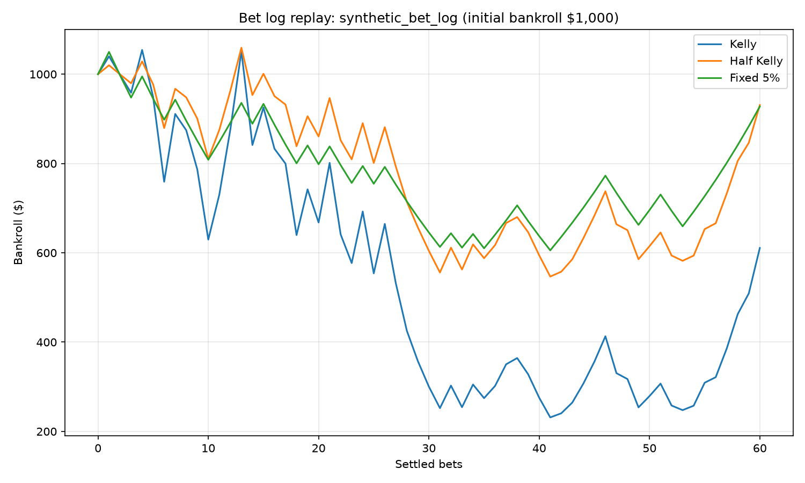

Replay a recorded bet log
=========================

``examples/replay_bet_log.py`` takes a chronological CSV of probability estimates
and recorded outcomes, replays the same bets through Kelly, Half Kelly and
Fixed Fraction (5%), then reduces each :attr:`~keeks.bankroll.BankRoll.history`
with :func:`~keeks.metrics.summarize_history`. Each strategy gets a fresh $1,000
bankroll, with all funds bettable and no per-transaction loss cap.

.. warning::

   The committed log is **synthetic**, generated once with Python's
   ``random.Random(140)``. It is one illustrative path, not evidence of an edge,
   a forecast, or a strategy recommendation. Keeks is educational only and
   does not provide financial advice. Replaying your own estimates does not
   establish that those estimates are calibrated or predict future results.

Input format
------------

The committed ``examples/data/synthetic_bet_log.csv`` starts with:

.. literalinclude:: ../../../examples/data/synthetic_bet_log.csv
   :language: text
   :lines: 1-6

``probability`` is the estimate made **before** the outcome was known, in
``[0, 1]``. ``outcome`` is an integer: ``1`` for a win, ``0`` for a loss.
Keep rows in their original order: reversing them changes drawdown and can
change sizing when bankroll safeguards bind. The data README records the
fixed-seed generation recipe; no generator runs during replay.

This example assumes the same even-money odds for every row: net profit of
1 unit per unit staked on a win, loss of 1 on a loss. Both the strategies'
``transaction_cost_rate`` (per unit) and the simulator's ``fee_per_bet``
(flat currency fee per settlement) are zero. Adapt these controls together
when using your own log; this script does not model changing odds per row.

Reading the comparison
----------------------

         bets. All start at 1,000 dollars; Kelly ends near 611 dollars,
         Half Kelly near 931 and Fixed 5% near 928.
   :width: 100%

   All three strategies replay the same recorded outcomes without drawing
   random numbers. Kelly's larger stakes produce deeper losses on this path.

.. csv-table:: Summary of this synthetic replay
   :file: ../../../examples/output/replay_bet_log.csv
   :header-rows: 1

The CSV reports input rows separately from ``bets``: history records
transactions, so skipped bets do not add entries. The plot's horizontal axis
also counts settled bets, rather than input rows. All 60 rows settle for each
strategy in this fixture. Kelly and Half Kelly vary stakes with the estimated
edge; Fixed 5% stakes a constant fraction when probability meets its default
0.5 threshold.

``max_drawdown`` is the largest fractional loss from a running peak (0.78 means
about 78%), not a single-bet loss limit. ``total_return`` is ``end / start - 1``;
``geometric_growth_per_period`` compounds over recorded settlements, not days
or years. Undefined metrics are blank in the CSV, rather than invented zeros.
These are summaries of one path, not averages over repeated simulations.

Reproducing it and using your own log
-------------------------------------

From a repository checkout with development dependencies installed:

.. code-block:: bash

   uv run python examples/replay_bet_log.py
   # Or run the examples group:
   make examples

The script writes ``examples/output/replay_bet_log.csv`` and
``examples/output/replay_bet_log.png`` using a headless matplotlib backend.
Rerunning with the same input produces byte-identical CSV.
To compare your own chronological CSV with the same odds assumptions:

.. code-block:: bash

   uv run python examples/replay_bet_log.py /path/to/my_bets.csv

This overwrites the two example outputs; keep your personal log and generated
results out of version control. The complete loading, replay and summary code
is in `replay_bet_log.py <https://github.com/wdm0006/keeks/blob/master/examples/replay_bet_log.py>`_.
