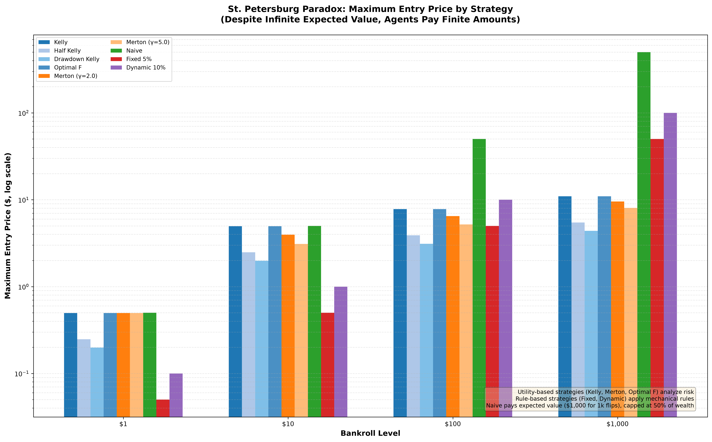

The St. Petersburg paradox
==========================

Flip a fair coin until it lands tails and you are paid $2\ :sup:`n`, where
*n* is the number of flips. Each branch of the game contributes
(1/2\ :sup:`n`) × 2\ :sup:`n` = $1 to the expectation, so the expected
payout is infinite — and yet no rational person pays much to play. That
gap between infinite expectation and finite willingness-to-pay is the St.
Petersburg paradox, and it is the cleanest demonstration of why a growth
criterion, not an expectation, is what sizes a bet.

``examples/st_petersburg_paradox.py`` turns the paradox into a pricing
question for keeks' strategies: what is the maximum entry price each of
the nine shipped strategies would pay to play one round, at bankrolls of
$1, $10, $100 and $1,000? Each strategy answers through
``calculate_max_entry_price`` over the game's outcome distribution, capped
at 1,000 flips (the practical limit of float64), where the capped game's
expected value is $1,000 — each flip contributing exactly $1 of it.

.. warning::

   These are simulated results from a model, not a forecast and not
   investment advice. The game is a mathematical ideal — a fair coin, an
   unlimited counterparty, and a payout schedule no real venue honours —
   and the entry prices are what each rule would bid inside its own
   assumptions. Keeks is an educational library; treat every number below
   as a property of the model, not a prediction about money.

What the spread says
--------------------

         price for nine strategies at bankrolls of 1, 10, 100 and 1,000
         dollars, with utility-based and rule-based strategies in
         distinguishable blue, orange, green, red and purple families.
         Every strategy bids more as wealth grows. The Naive rule is the
         tallest bar at the 100 and 1,000 dollar bankrolls — near 50 and
         460 dollars — while at the 1,000 dollar bankroll Dynamic bids
         about 100, Kelly and Optimal F about 10 to 11, the two Merton
         shares about 8 to 9, and Half Kelly and Drawdown Kelly about 4 to
         5. An annotation notes that Naive pays expected value capped at
         50% of wealth.
   :width: 100%

   Maximum entry price by strategy and wealth level. Higher bars mean the
   rule would pay more for one round of a game with infinite expected
   value.

The utility-based rules — Kelly, its fractional and drawdown-adjusted
variants, Optimal F, and the Merton shares at risk aversion 2 and 5 —
price the game conservatively and scale gently with wealth: log and
power utility refuse to pay much for lottery-like tails, whatever the
expectation says. The rule-based strategies bid mechanically, and at a
$1,000 bankroll they are the aggressive bidders: Dynamic 10% bids about
$100, Fixed 5% bids a wealth fraction, and Naive pays the capped expected
value — 50% of wealth, about $460, the tallest bar on the chart. Four
orders of magnitude separate the most and least willing bidders, all
facing the same infinite-EV game.

That inversion — the "naive" rule outbidding Kelly for a positive-EV
game — is the paradox made practical: an expectation-only rule cannot see
that the payout is concentrated in a branch you will essentially never
see, while a growth criterion prices the bet you actually experience.

Reproducing it
--------------

One command, from a checkout of the repository:

.. code-block:: bash

   uv run python examples/st_petersburg_paradox.py

It prints the maximum entry price for each of the nine strategies at each
wealth level — in dollars and as a percentage of bankroll — and writes the
chart plus ``examples/output/st_petersburg_paradox.csv`` with both views
of every cell.
