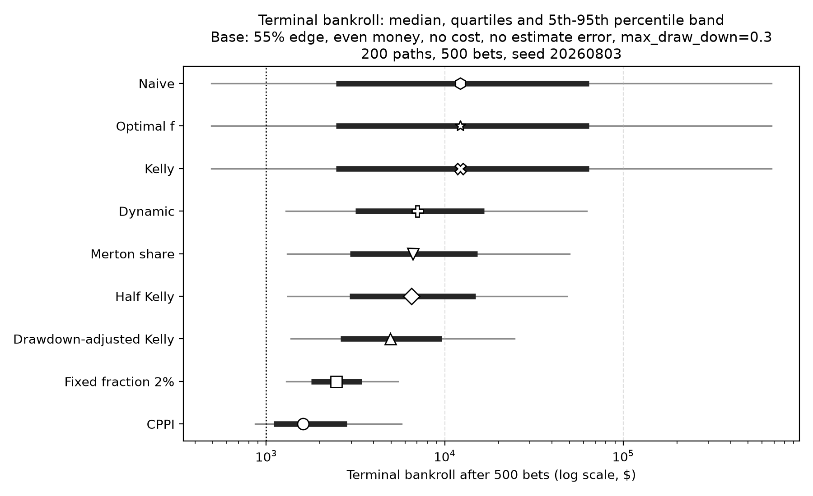
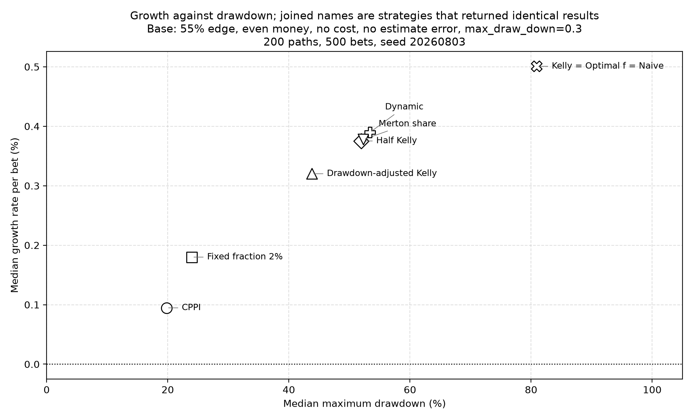
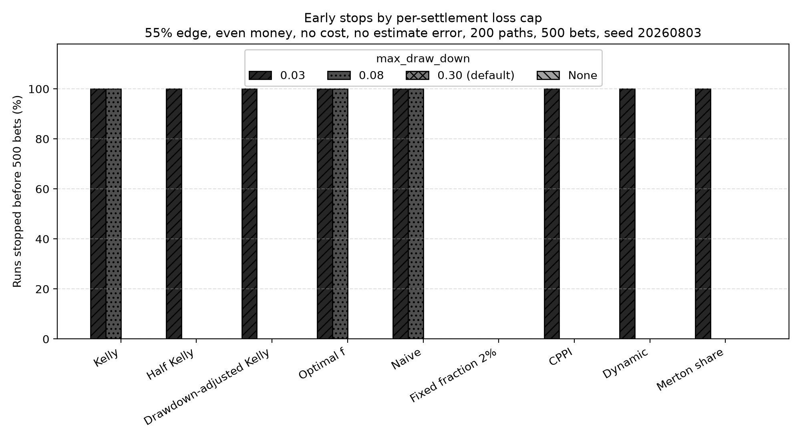

Nine-Strategy Risk Benchmark
============================

Every strategy in Keeks implements the same ``evaluate(probability,
current_bankroll)`` contract, so they can be swapped for one another. This page
answers what that swap actually costs: what growth, drawdown and early-stop
behaviour each of the nine shipped strategies produces under identical
assumptions, and how that changes when the edge, the cost input, the quality of
the probability estimate, or the bankroll's loss cap changes.

There is no winner here. Which row you want depends on how much drawdown you are
willing to sit through, and the benchmark's job is to price that choice rather
than make it for you.

.. warning::

   These are simulated results from a model, not a forecast and not investment
   advice. The simulator assumes a known win probability, an independent binary
   outcome per bet, and no market impact — none of which hold in a real book.
   Keeks is an educational library; treat every number below as a property of
   the model, not a prediction about money.

Reproducing it
--------------

One command, from a checkout of the repository:

.. code-block:: bash

   uv run python benchmarks/strategy_benchmark.py

It takes about half a minute and rewrites ``benchmarks/output/`` in place:
``strategy_benchmark.csv`` (one row per scenario and strategy, with every metric
below) and the three charts on this page. The run is fully seeded — two runs on
the same machine produce byte-identical files, including the PNGs — so a diff on
the output is a real change in behaviour, not noise.

To ask a different question, edit ``SCENARIOS`` or ``STRATEGY_FACTORIES`` at the
top of the script and rerun.

Method
------

**Fixed seeds and shared paths.** The master seed is ``20260803``. Each of the
200 paths draws its 500 uniform outcomes from ``random.Random`` keyed on the path
index alone, so the same 200 outcome sequences are reused by every strategy *and*
every scenario. A cell that a scenario axis does not touch reproduces its
base-scenario number exactly rather than re-rolling it.

**Common random numbers.** Outcomes are replayed by trial index, not by call
order. This matters because the simulator only draws a random number when a bet
is actually placed: seeding the global generator alone would mean a strategy that
declines one trial sees every later outcome shifted relative to its peers. Here,
trial *t* of path *p* resolves the same way for all nine strategies.

**Fresh state everywhere.** Each (scenario, strategy, path) triple builds a new
``BankRoll`` and a new strategy object. Simulators mutate the bankroll in place,
and ``CPPIStrategy`` and ``DynamicBankrollManagement`` carry state across
``evaluate`` calls, so anything less would let one path contaminate the next.

**Matched assumptions.** The strategy and the simulator receive the same
``payoff``, the same ``loss`` and the same cost scalar. The payoff and loss
multipliers mean the same thing on both sides. The cost scalar does not, and that
is a property of the library rather than of this benchmark — see
`What the cost input actually does`_.

**Estimate error.** Keeks ships an uncertain simulator, but it centres its
probability draws on 0.5 and therefore cannot express an edge. To vary estimate
quality against a real edge, the benchmark instead perturbs the probability handed
to ``strategy.evaluate`` — the strategy sizes its bet on ``p + σ·Z``, clipped to
``[0.01, 0.99]``, while the simulator settles the outcome against the true ``p``.
The standard normal shocks ``Z`` are drawn per path and shared across scenarios,
so the ``σ = 0.06`` run is the ``σ = 0.03`` run with the same shocks scaled up.

**Metrics.** Terminal bankroll is reported as a median with 5th, 25th, 75th and
95th percentiles, because the mean of this distribution is carried by a handful of
enormous paths and describes nobody's experience. Maximum drawdown is the largest
peak-to-trough fall in ``bankroll.history``. Growth rate is
``ln(terminal / 1000) / 500`` per bet, over the full nominal horizon, so a run
that stopped early is charged for the bets it never got to place. Early stops are
recorded, not inferred: the benchmark subclasses ``BankRoll`` to capture the
reason a settlement was refused, and reports the drawdown-cap and bankruptcy
rates separately.

**Fixed inputs.** $1,000 starting bankroll, 500 bets, 200 paths, even money
(``payoff = 1.0``, ``loss = 1.0``), ``percent_bettable = 1.0``. The base scenario
is a 55% win probability, a zero cost input, no estimate error, and the library's
default ``max_draw_down = 0.3``.

The strategies are configured once each: full Kelly; fractional Kelly at 0.5;
drawdown-adjusted Kelly at ``max_acceptable_drawdown = 0.2``; Optimal f with
``win_rate`` set to the scenario's true probability and
``max_risk_fraction = 0.2``; the naive expected-value rule; a flat 2% fixed
fraction; CPPI with an 80% floor and a multiplier of 2; dynamic bankroll
management with a 5% base fraction; and the Merton share at
``risk_aversion = 2.0``.

Base scenario
-------------

55% win probability, even money, no cost, no estimate error, ``max_draw_down =
0.3``. All figures are dollars unless marked otherwise; "Stake" is the fraction
of the bankroll wagered on the first bet, "MDD" is maximum drawdown.

=======================  ======  ======  =======  =====  =====  ======  =======  ========  =======  ==========  ===========
Strategy                 Stake   Median  Mean     p5     p25    p75     p95      Med. MDD  p95 MDD  Growth/bet  Early stops
=======================  ======  ======  =======  =====  =====  ======  =======  ========  =======  ==========  ===========
Kelly                    10.00%  12,234  184,934  493    2,457  64,304  676,950  81%       96%      0.501%      0%
Optimal f                10.00%  12,234  184,934  493    2,457  64,304  676,950  81%       96%      0.501%      0%
Naive                    10.00%  12,234  184,934  493    2,457  64,304  676,950  81%       96%      0.501%      0%
Half Kelly               5.00%   6,529   13,660   1,316  2,932  14,924  48,326   52%       76%      0.375%      0%
Merton share             5.05%   6,612   14,029   1,312  2,945  15,240  49,940   52%       76%      0.378%      0%
Dynamic                  5.00%   7,019   15,832   1,288  3,159  16,632  62,396   53%       76%      0.390%      0%
Drawdown-adjusted Kelly  4.00%   4,957   8,058    1,377  2,613  9,600   24,572   44%       66%      0.320%      0%
Fixed fraction 2%        2.00%   2,460   2,823    1,297  1,786  3,422   5,475    24%       39%      0.180%      0%
CPPI                     4.00%   1,605   2,352    866    1,103  2,834   5,720    20%       20%      0.095%      0%
=======================  ======  ======  =======  =====  =====  ======  =======  ========  =======  ==========  ===========

         strategies on a logarithmic dollar axis. Each row shows a thin line for
         the 5th-to-95th percentile, a thick bar for the interquartile range and
         an open marker at the median. Kelly, Optimal f and Naive share the
         widest band, from about 490 dollars at the 5th percentile to about
         677,000 at the 95th, with a median near 12,200. Half Kelly, Merton share
         and Dynamic form a middle group with medians near 6,500 to 7,000 and
         5th percentiles above the 1,000 dollar starting line. Fixed fraction 2%
         and CPPI have the narrowest bands and the lowest medians, near 2,500 and
         1,600. A dotted vertical line marks the 1,000 dollar starting bankroll.
   :width: 100%

   Terminal bankroll after 500 bets, base scenario. Median, quartiles and the
   5th-to-95th percentile band over 200 paths.

Growth and drawdown move together, and almost linearly. Kelly's median result is
five times Half Kelly's, but it gets there by sitting through an 81% median
peak-to-trough fall, and one path in twenty ends below $493 — a 51% loss over 500
bets with a genuine 5% edge.

         to 105 percent and median growth rate per bet on the vertical axis from
         0 to about 0.55 percent. Nine strategies form a rising line. CPPI sits
         lowest at about 20 percent drawdown and 0.095 percent growth, then Fixed
         fraction 2% at 24 percent and 0.18 percent, Drawdown-adjusted Kelly at
         44 percent and 0.32 percent, a cluster of Half Kelly, Merton share and
         Dynamic near 52 to 53 percent and 0.375 to 0.39 percent, and finally a
         single point labelled Kelly = Optimal f = Naive at 81 percent drawdown
         and 0.501 percent growth. Labels are joined by leader lines to their
         markers.
   :width: 100%

   Median growth against median maximum drawdown, base scenario. Joined names are
   strategies whose results were identical.

Three strategies are the same rule here
---------------------------------------

Kelly, Optimal f and Naive return identical numbers in the base scenario, and in
every scenario where the cost input is zero. That is not a bug in the benchmark;
it falls out of the formulas whenever ``loss = 1``, the ordinary binary bet where
you stake your money and lose it all if you are wrong:

* Kelly returns ``p/(loss + cost) - q/(payoff - cost)``, which at ``loss = 1`` and
  ``cost = 0`` is ``p - q/payoff``.
* ``NaiveStrategy`` returns ``(p·payoff - q·loss - cost)/payoff``, which under the
  same conditions is also ``p - q/payoff``.
* ``OptimalF`` returns ``win_rate - (1 - win_rate)·(loss + cost)/(payoff - cost)``,
  which with ``win_rate = p`` is again ``p - q/payoff``.

A nonzero cost input separates them, but only slightly: at ``cost = 0.05`` the
three stake 5.01%, 5.00% and 5.26%. If you are reaching for ``NaiveStrategy`` as
an unsophisticated control against Kelly, it is not one for a standard binary
bet. ``FixedFractionStrategy``, and CPPI, are the honest baselines.

At a 51% edge the coincidence widens: full Kelly stakes 2%, which is exactly what
the flat 2% rule stakes, so four of the nine produce the same path.

What the cost input actually does
---------------------------------

Strategies treat ``transaction_cost`` as a **per-unit fractional** cost, folded
into the payoff and loss multipliers before the growth optimum is computed.
Simulators treat ``transaction_costs`` as a **flat fee per settled bet**. The same
number means different things on the two sides, and at a $1,000 bankroll the
difference is three orders of magnitude:

=======================  ===============  ==================  ================================
Strategy                 Stake at cost 0  Stake at cost 0.05  Fee actually charged, % of stake
=======================  ===============  ==================  ================================
Kelly                    10.00%           5.01%               0.021%
Optimal f                10.00%           5.26%               0.018%
Naive                    10.00%           5.00%               0.021%
Half Kelly               5.00%            2.51%               0.098%
Merton share             5.05%            2.53%               0.097%
Dynamic                  5.00%            5.00%               0.017%
Drawdown-adjusted Kelly  4.00%            2.00%               0.143%
Fixed fraction 2%        2.00%            2.00%               0.144%
CPPI                     4.00%            2.00%               0.254%
=======================  ===============  ==================  ================================

Passing ``0.05`` to both sides halves what Kelly stakes while costing it 0.021% of
each stake. So a cost sweep in Keeks measures how conservative the cost input
makes a strategy, not how much friction erodes the bankroll. Two strategies ignore
the parameter for sizing entirely: ``FixedFractionStrategy`` by design, and
``DynamicBankrollManagement`` because its ``min_fraction`` floor holds it at 5%
regardless.

If you want to model real friction, scale the flat ``transaction_costs`` against
the bankroll and stake sizes you actually expect, and do not assume the same
number on the strategy side is doing comparable work.

``max_draw_down`` is a per-settlement cap, not a risk budget
------------------------------------------------------------

``BankRoll`` refuses any single withdrawal larger than ``max_draw_down`` times
current funds and raises ``RuinError``; the simulator catches it and stops the
run. It is a cap on one settlement, not on cumulative peak-to-trough loss, and
that makes it behave as a switch rather than a dial:

         for nine strategies at four values of max_draw_down, drawn in greyscale
         with four distinct hatch patterns. Every bar is either 0 percent or 100
         percent. At a cap of 0.03 all strategies except Fixed fraction 2% stop on
         every path. At a cap of 0.08 only Kelly, Optimal f and Naive stop, again
         on every path. At the default cap of 0.30 and with no cap at
         all, no strategy stops and every bar is zero.
   :width: 100%

   Early stops by per-settlement loss cap, 55% edge, no cost, no estimate error.

Every bar is either zero or full height. A strategy stakes a roughly fixed
fraction, so the cap either sits above that fraction and never binds, or sits
below it and kills the run on the first losing bet — at a cap of 0.08 the Kelly
group stops after a median of 2 bets.
The default ``max_draw_down = 0.3`` never binds for any of the
nine at a 55% edge, because none of them stakes more than 10%.

There is a second-order trap: a stopped run has a *lower* measured maximum
drawdown than a completed one, because the losing settlement is refused rather
than applied. At a cap of 0.08 the Kelly group's median maximum drawdown is 0%,
which is a number produced by not playing.

If you want a cumulative drawdown budget, use ``DrawdownAdjustedKelly``, which
shrinks the bet fraction, or ``CPPIStrategy``, which holds a floor. Do not read
``max_draw_down`` as one.

How each axis moves the result
------------------------------

Median terminal bankroll, in dollars, across the whole matrix. The base column
repeats the table above.

=======================  ========  ===============  ==========  =========  =========  =======  =======  ========  ========  ========
Strategy                 51% edge  55% edge (base)  60% edge    cost 0.01  cost 0.05  sd 0.03  sd 0.06  cap 0.08  cap 0.03  cap None
=======================  ========  ===============  ==========  =========  =========  =======  =======  ========  ========  ========
Kelly                    1,150     12,234           23,570,857  11,906     6,475      5,096    1,238    1,100     1,100     12,234
Optimal f                1,150     12,234           23,570,857  11,958     6,885      12,174   7,826    1,100     1,100     12,234
Naive                    1,150     12,234           23,570,857  11,906     6,455      5,096    1,238    1,100     1,100     12,234
Half Kelly               1,100     6,529            1,846,327   5,712      2,948      5,397    4,208    6,529     1,050     6,529
Merton share             1,100     6,612            2,269,001   5,783      2,969      5,474    3,079    6,612     1,051     6,612
Dynamic                  930       7,019            117,909     6,999      6,920      6,340    4,857    7,019     1,050     7,019
Drawdown-adjusted Kelly  1,083     4,957            609,105     4,367      2,424      4,397    3,971    4,957     1,040     4,957
Fixed fraction 2%        1,150     2,460            6,688       2,452      2,419      2,420    2,076    2,460     2,460     2,460
CPPI                     1,034     1,605            3,026       1,683      1,705      1,240    1,056    1,605     1,040     1,605
=======================  ========  ===============  ==========  =========  =========  =======  =======  ========  ========  ========

Percentage of the 200 paths that stopped before all 500 bets were placed:

=======================  ========  ===============  ========  =========  =========  =======  =======  ========  ========  ========
Strategy                 51% edge  55% edge (base)  60% edge  cost 0.01  cost 0.05  sd 0.03  sd 0.06  cap 0.08  cap 0.03  cap None
=======================  ========  ===============  ========  =========  =========  =======  =======  ========  ========  ========
Kelly                    0         0                0         0          0          10       100      100       100       0
Optimal f                0         0                0         0          0          0        0        100       100       0
Naive                    0         0                0         0          0          10       100      100       100       0
Half Kelly               0         0                0         0          0          0        0        0         100       0
Merton share             0         0                0         0          0          0        22       0         100       0
Dynamic                  0         0                0         0          0          0        0        0         100       0
Drawdown-adjusted Kelly  0         0                0         0          0          0        0        0         100       0
Fixed fraction 2%        0         0                0         0          0          0        0        0         0         0
CPPI                     0         0                0         0          0          0        0        0         100       0
=======================  ========  ===============  ========  =========  =========  =======  =======  ========  ========  ========

Every early stop in this matrix is a ``max_draw_down`` breach. No path in any
scenario reached bankruptcy, which is what the drawdown cap is there to prevent.

**Edge.** Growth is extremely sensitive to it. Moving from a 55% to a 60% win
probability takes Kelly's median from $12,234 to $23.6 million; moving down to
51% takes it to $1,150 — a 15% gain over 500 bets. At 51%, ``Dynamic`` stands
alone in producing a *negative* median: its 5% minimum fraction forces a stake
more than twice what the edge supports, and it ends the median path at $930.

**Estimate error.** This is where the strategies stop being scaled versions of one
another. At σ = 0.06 the Kelly group trips the default drawdown cap on all 200
paths, because a probability estimate that lands near 0.70 tells Kelly to stake
40%, and a 40% loss is refused. Optimal f is untouched: it sizes from its
configured ``win_rate`` and uses the per-trial probability only as a 0.5 bet or
no-bet gate, so noise makes it skip bets rather than oversize them. Half Kelly
absorbs the noise; Merton share stops on 22% of paths.

**Cost.** Nothing stops, and every strategy that responds to the parameter simply
bets less. See the previous section for why the effect is one-sided.

Seed stability
--------------

Each cell is a median over 200 seeded paths, so it is an estimate with sampling
error, not an exact constant. Re-running the base scenario under five master seeds
(``20260803``, ``1``, ``7``, ``42``, ``12345``) moves Kelly's median terminal
bankroll between $12,234 and $14,952 and Half Kelly's between $6,529 and $7,217.
The ranking of the nine strategies is unchanged in all five runs, and the base
scenario's early-stop rate is zero for every strategy in all five.

The headline early-stop findings are equally stable: at σ = 0.06 Kelly and Naive
stopped on all 200 paths under all five seeds, Optimal f on none, and Merton share
on 18% to 28%.

Read a single cell as "about this much", and read the gaps between rows — which
are large and stable — as the real result.

Choosing a strategy
-------------------

The benchmark does not rank the nine, because the ranking depends entirely on the
drawdown you can tolerate and on how much you trust your probability estimate.
What it does support:

* **If your probability estimate is good and you can sit through an 80% drawdown**,
  full Kelly earns its reputation, and Optimal f and Naive are the same rule.
* **If you are not certain of your edge**, the estimate-error column is the one to
  read, not the growth column. Full Kelly under a noisy estimate hit the drawdown
  cap on every path; Half Kelly did not. Fractional Kelly's usual justification —
  that it buys robustness to estimation error rather than just lower variance —
  is visible in this matrix.
* **If you want a cumulative drawdown budget**, use ``DrawdownAdjustedKelly`` or
  ``CPPIStrategy``. ``max_draw_down`` will not give you one.
* **If you want a control to measure a strategy against**, use
  ``FixedFractionStrategy``. ``NaiveStrategy`` is Kelly for a standard binary bet.
* **If capital preservation dominates**, CPPI had the tightest distribution of the
  nine — a 20% median maximum drawdown, capped by construction — and paid for it
  with the lowest growth.

Limitations
-----------

* One simulator (``RepeatedBinarySimulator``) and one bet shape: independent,
  even-money, binary, with a probability that never changes within a run. Real
  edges vary bet to bet and are correlated across bets.
* One configuration per strategy. Every tunable — the Kelly fraction, CPPI's
  floor and multiplier, Optimal f's ``max_risk_fraction``, Merton's risk aversion
  — moves its row, and the parameters chosen here are reasonable rather than
  optimal.
* 500 bets and a $1,000 bankroll. Both interact with the flat transaction fee and
  with ``BankRoll``'s two-decimal rounding.
* Estimate error is modelled as independent zero-mean noise on a correct
  probability. A persistent bias — believing you have an edge you do not — is a
  different and more dangerous failure, and is not measured here.
* The library's cost model is a single normalized scalar. It does not represent
  spreads, slippage, market impact, per-venue commissions, correlated positions
  or rebalancing.

Full results are in ``benchmarks/output/strategy_benchmark.csv``: one row per
scenario and strategy, with every percentile, drawdown, growth and stop-reason
column used above.
